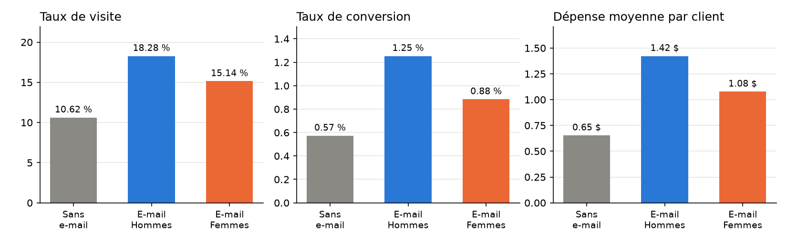
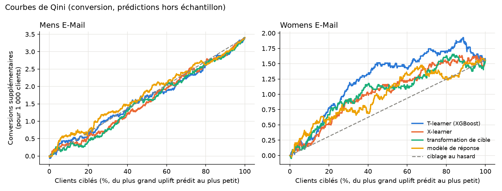
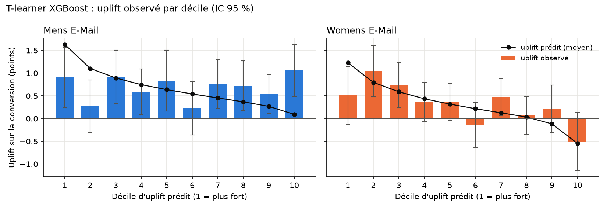
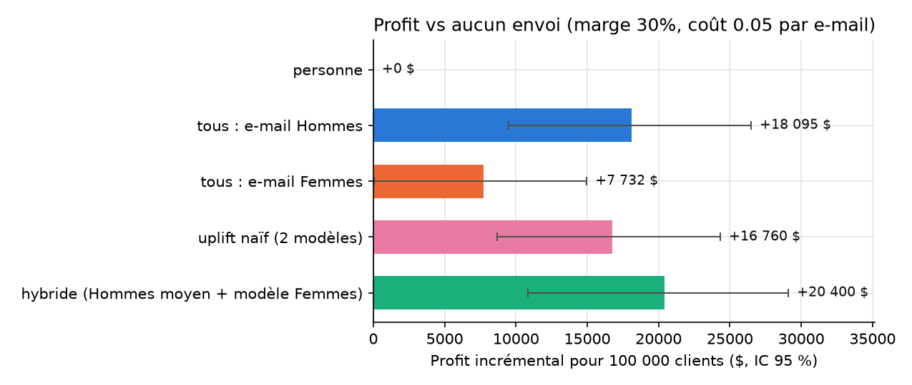
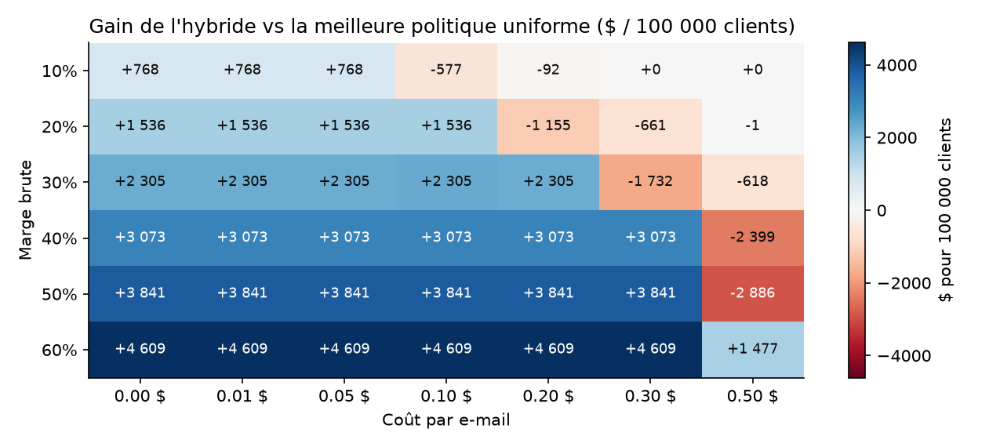

# CampaignLift — Rapport de synthèse

**Question** : une campagne e-mail vaut-elle le coût de l'envoi, pour quels clients, et combien rapporte-t-elle ?

**Réponse courte** : envoyer l'**e-mail Hommes à tous les clients**. Pour 100 000 clients, cela rapporte environ **+77 000 $ de chiffre d'affaires** et **+18 100 $ de profit**, pour 5 000 $ de coûts d'envoi (**ROI ≈ 3,6**). Ce choix reste valable tant que le coût complet d'un e-mail est inférieur à 0,77 $ × marge, soit ≈ 0,23 $ avec une marge de 30 %. Cibler l'e-mail à l'aide de modèles d'uplift **n'apporte pas de gain démontrable** sur ces données.

---

## 1. Données et protocole

Le jeu de données est l'expérience randomisée de Kevin Hillstrom (MineThatData, 2008). Pendant deux semaines, 64 000 clients ayant acheté dans l'année ont été répartis au hasard en trois groupes : **e-mail Hommes**, **e-mail Femmes**, **aucun e-mail**. Trois résultats ont été mesurés : la visite du site, l'achat (conversion) et le montant dépensé.

**La randomisation a fonctionné** (`notebooks/01_exploration.ipynb`) :
- les effectifs sont conformes au tiers attendu (χ² = 0,20, p = 0,90) ;
- toutes les covariables sont équilibrées : différences standardisées ≤ 0,014, contre un seuil usuel de 0,1.

Les écarts entre groupes s'interprètent donc comme des **effets causaux** des e-mails.

Une particularité structure toute l'analyse : **99,1 % des clients ne dépensent rien** sur la période. Il n'y a que 578 acheteurs, pour des paniers de 30 $ à 499 $.

## 2. Effet moyen des e-mails

Source : `notebooks/02_ab_tests.ipynb`.

| vs aucun e-mail | E-mail Hommes | E-mail Femmes |
|---|---|---|
| Visite | +7,7 pts (10,6 % → 18,3 %) | +4,5 pts |
| Conversion | +0,68 pt (0,57 % → 1,25 %, ×2,2) | +0,31 pt |
| **Dépense par client** | **+0,77 $** [0,49 ; 1,05] | +0,42 $ [0,17 ; 0,68] |

- **Robustesse statistique** : les effets restent significatifs après correction de Holm pour 9 comparaisons. Malgré la forte asymétrie de la dépense, un bootstrap confirme les intervalles du test de Welch.
- **Comparaison des deux e-mails** : l'e-mail Hommes est meilleur que l'e-mail Femmes, nettement sur la visite et la conversion, de justesse sur la dépense (p = 0,03).
- **Mécanisme** : l'e-mail agit en faisant **acheter plus de clients**, pas en augmentant le panier (≈ 114 $ dans tous les groupes).
- **Covariables** : les ajuster (ANCOVA / CUPED) ne réduit l'incertitude que de 0,1 à 1,4 %, car l'historique d'un client prédit très mal ses achats sur deux semaines.

## 3. Ce que l'expérience pouvait détecter

Source : `notebooks/03_power_analysis.ipynb`.

| Métrique | Effet minimal détectable (80 %, α = 5 %) | Clients par groupe pour détecter +10 % |
|---|---|---|
| Visite | +8 % | ≈ 14 000 |
| Conversion | +39 % | ≈ 290 000 |
| Dépense | +50 % | ≈ 500 000 |

- **Formule « de manuel » trop optimiste** : elle suppose des variances égales et surestime la puissance pour les événements rares. Une simulation a donné 74 % de puissance réelle là où elle annonçait 80 %. Une formule corrigée, validée par simulation, est utilisée partout.
- **Conséquence pratique** : piloter les prochains tests sur la **visite**, qui demande 20 à 35 fois moins de clients que la dépense.
- **Sous-groupes** : les comparaisons entre sous-groupes ont peu de puissance (≈ 30 %). Une interaction non significative n'y prouve donc rien.

## 4. À qui l'e-mail fait-il vraiment quelque chose ?

Source : `notebooks/04_uplift_models.ipynb`.

Des modèles d'**uplift** estiment l'effet de l'e-mail **client par client** : modèle de réponse en point de comparaison, puis S-, T- et X-learners et transformation de cible, tous sur base XGBoost. L'évaluation porte sur des prédictions hors échantillon, obtenues par validation croisée en 5 plis. Chaque modèle est confronté à des classements aléatoires (test par permutation) : avec un signal aussi faible, c'est indispensable.

- **E-mail Femmes : effet hétérogène, bien capté.** Le T-learner trie les clients nettement mieux que le hasard (p = 0,002). En ciblant les 45 % de clients au plus fort uplift prédit, on obtient la quasi-totalité de l'effet. Les données brutes confirment deux résultats :
  - l'effet est **nul chez les clients ayant déjà acheté des produits hommes et dépensé ≤ 500 $**, soit près de la moitié de la base ;
  - il est le plus fort chez les **gros clients** (> 500 $).
- **E-mail Hommes : effet homogène.** Aucun modèle ne fait mieux que le hasard. Le modèle *prédit* des écarts entre clients, mais l'effet *observé* est le même dans tous les déciles : ces écarts prédits sont du bruit.

## 5. Décision et rentabilité

Source : `notebooks/05_targeting_roi.ipynb`.

**Hypothèses** (le jeu de données ne fournit que le chiffre d'affaires) :
- marge brute de **30 %** ;
- coût complet de **0,05 $ par e-mail** : envoi, création, et coût de désabonnement ou de fatigue des clients.

Les deux hypothèses sont testées sur une grille de sensibilité.

**Évaluation des politiques** : chaque politique est évaluée sur les données randomisées, sans avoir été appliquée. Pour chaque action, on regarde les clients qui l'ont reçue par hasard. Les intervalles viennent d'un bootstrap apparié.

| Politique (100 000 clients) | Profit vs aucun envoi | vs « tous Hommes » |
|---|---|---|
| **Tous : e-mail Hommes** | **+18 100 $** [9 500 ; 26 500] | — |
| Tous : e-mail Femmes | +7 700 $ | −10 400 $ (significatif) |
| Uplift naïf (deux modèles) | +16 800 $ | −1 300 $ [−6 200 ; +4 000] |
| Hybride (effet moyen Hommes + modèle Femmes) | +20 400 $ | +2 300 $ [−1 600 ; +6 700] |

Les enseignements :
- **Un modèle d'uplift mal validé n'apporte rien.** La politique qui se fie aux deux modèles fait plutôt moins bien que l'envoi à tous, car elle exploite le bruit du modèle Hommes.
- **La politique hybride** ne garde le modèle que là où il est validé (l'e-mail Femmes, envoyé à 21 % des clients). Elle gagne ≈ +2 300 $. Mais démontrer ce gain demanderait ≈ 720 000 clients par bras : il est trop petit pour être prouvé.
- **Au-delà du seuil de coût** (≈ 0,23 $ par e-mail à 30 % de marge), aucune politique ne bat « aucun envoi ». Aucune niche rentable n'a été trouvée.

## 6. Recommandation

1. **Envoyer l'e-mail Hommes à tous les clients**, tant que coût par e-mail < 0,77 $ × marge.
2. **Ne pas cibler l'e-mail Hommes** par un modèle : son effet est le même pour tous.
3. **Option facultative** : envoyer l'e-mail Femmes plutôt que l'e-mail Hommes aux ≈ 21 % de clients que le modèle juge plus réceptifs. Gain attendu ≈ +2 300 $ pour 100 000 clients, non démontré. À ne retenir que si produire deux e-mails ne coûte rien de plus.
4. **Pas de campagne de masse** si le canal coûte plus que le seuil (courrier, bon de réduction).
5. **Garder un groupe contrôle d'environ 10 %** dans chaque campagne, pour continuer à mesurer l'effet réel.

## 7. Limites

- **Hypothèses économiques externes** : la marge et le coût par e-mail ne viennent pas des données ; la grille de sensibilité couvre 10-60 % de marge et 0-0,50 $ de coût.
- **Horizon court** : l'effet est mesuré sur **deux semaines**. L'effet à long terme est inconnu, qu'il s'agisse de fidélisation ou de fatigue.
- **Données anciennes** : elles datent de 2008 ; les ordres de grandeur sont à revalider sur des données récentes.
- **Évaluation un peu optimiste de l'hybride** : cette politique a été conçue après l'analyse des mêmes données.

---

*Reproduire* : `pip install -e .` puis `campaignlift --marge 0.30 --cout 0.05`. La commande rejoue toute l'analyse, et les tests (`pytest`) vérifient que le package retrouve les chiffres de ce rapport.
